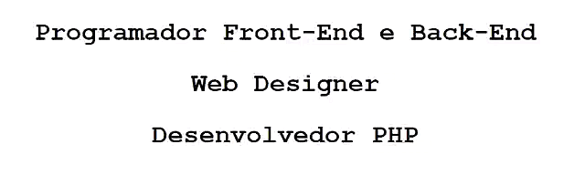

# Olá eu sou Felipe Akel

  

  

## Tecnologias e ferramentas que utilizo:

<link rel="stylesheet" href="https://cdn.jsdelivr.net/gh/devicons/devicon@v2.15.1/devicon.min.css">

  
  
  
  

  
  
  
  
  
  
  
  
  
  

## Algumas das minhas estatísticas

  

## Vamos nos conectar

  
   

